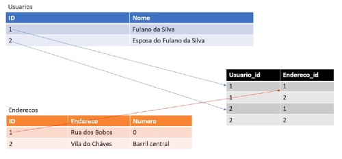

# Many to Many (Muitos para muitos)

O relacionamento _"Many to Many"_ indica uma relação de muitos para muitos (N:N).

Como forma de solucionar esse problema, é criada uma tabela auxiliar

## N:N

